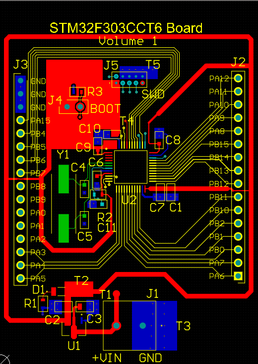
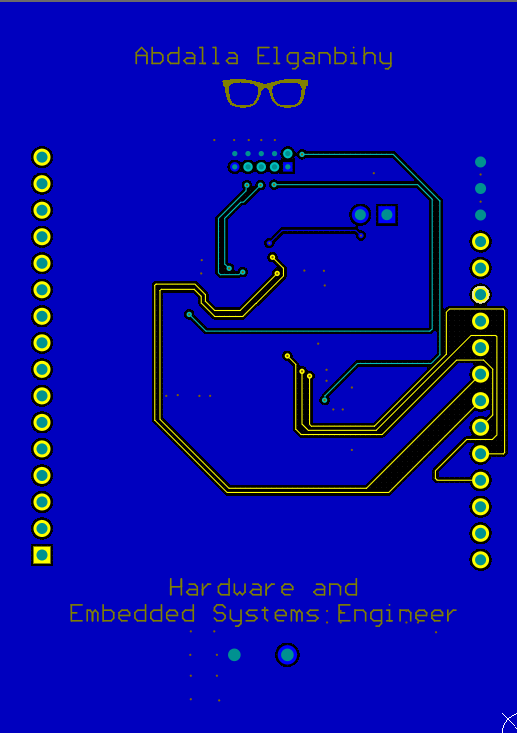
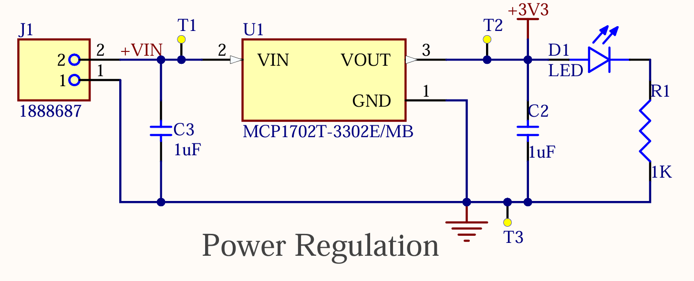
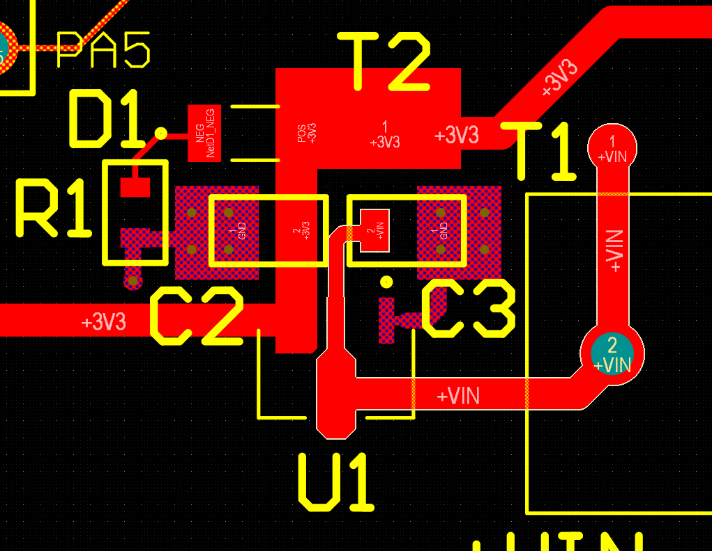
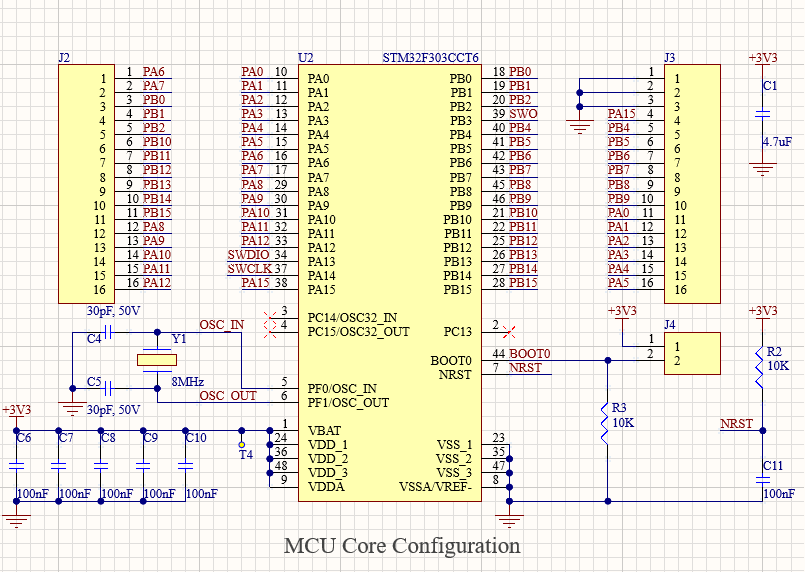
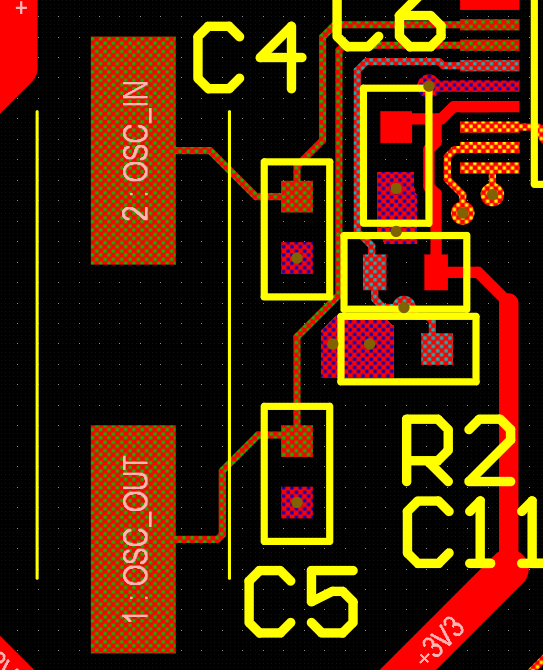

# STM32F303 Minimum Viable MCU Board

## Objective
Design a minimal STM32F303 board to validate first-principles MCU bring-up
(power, clocking, reset, and programming) without relying on development boards.
The goal was clarity, controllability, and debuggability rather than feature density.

---

## System Overview
- MCU: STM32F303CCT6 (LQFP)
- Supply: External VIN → 3.3 V regulation
- Clock: External 8 MHz HSE crystal
- Programming & Debug: SWD
- PCB: 2-layer, ground-referenced layout

  

    
    
  

  

    <a href="../assets/stm32-mcu-board/schematic.pdf" target="_blank">
      View full system schematic (PDF)
    </a>
  

---

## Power Regulation (VIN → 3V3)
The board is powered from an external VIN input and regulated to 3.3 V using a
low-dropout linear regulator.

Key decisions:
- LDO used to minimize noise during initial bring-up and debugging
- Input and output bulk capacitors placed close to the regulator pins
- Dedicated test points for VIN, 3V3, and GND to simplify probing
- Power LED included only as a basic visual indicator, not as a load reference

The layout prioritizes short, wide copper for power paths and a clear return
path into the ground plane.

  
  

---

## MCU Core Configuration & Decoupling
All STM32 power pins (VDD, VDDA) are decoupled locally with multiple 100 nF
capacitors placed as close as possible to the MCU pins. VDDA and VSSA are tied
cleanly into the ground reference to avoid introducing analog noise paths.

GPIOs are broken out symmetrically to two headers, allowing easy access to
both Port A and Port B without forcing early pin-function decisions.

This configuration keeps the MCU electrically quiet and mechanically accessible
during early firmware experiments.

---

## External Clock (HSE)
An external 8 MHz crystal is used to provide deterministic clocking during
bring-up and debugging.

Design and layout considerations:
- Parallel resonant crystal with matched load capacitors
- Crystal placed immediately adjacent to OSC_IN / OSC_OUT pins
- Short, symmetric traces to minimize loop area
- Local ground reference maintained around the oscillator network
- Clock traces kept isolated from power and high-activity GPIO routing

This avoids reliance on the internal oscillator and ensures predictable timing
behavior from the first power-up.

---

## BOOT Configuration & Reset Network
BOOT0 is pulled down by default to ensure normal boot from Flash. A dedicated
header allows manual override to 3.3 V when access to the system bootloader
is required.

NRST is conditioned with:
- A pull-up resistor to 3.3 V
- A small capacitor for clean power-on reset
- Direct access from the SWD header for debugger-controlled resets

Both signals are routed deliberately and kept away from noisy regions to avoid
unintentional mode changes or spurious resets.

---

## SWD Programming & Debug Interface
A standard 10-pin SWD header is implemented with:
- VTref tied to 3.3 V
- Dedicated SWDIO, SWCLK, and SWO signals
- NRST connected for reliable attach and reset control
- Multiple ground pins stitched directly into the ground plane

The header is placed close to the MCU to minimize trace length, and all SWD
signals are routed with a solid ground reference beneath them.

This allows stable debugging without relying on flying wires or adapters.

---

## Power Distribution Strategy (3V3 Ring)
The 3.3 V rail is implemented as a wide top-layer ring around the MCU rather than
as individual thin traces.

This was done intentionally to:
- Maintain a low-impedance power distribution path
- Enforce routing discipline during dense GPIO fan-out
- Prevent the 3V3 net from passing through the STM32 pin-escape region, where it
  would compete with signal routing and risk accidental neck-downs or coupling
- Keep all power entry into the MCU area controlled and peripheral, not opportunistic

The ring acts as a routing constraint as much as a power feature, trading routing
flexibility for predictability and safety.

---

## Grounding & Bottom Layer Strategy
The bottom layer is used almost entirely as a continuous ground plane.

Only a small number of signals are routed on the bottom layer where necessary
to complete escape routing without compromising the power or clock domains.

Benefits:
- Low-impedance return paths for all signals
- Stable reference plane for SWD and clock routing
- Reduced EMI risk and cleaner signal behavior
- Simplified mental model during debugging

This choice prioritizes electrical behavior over visual neatness.

---

## Issues & Lessons Learned
- Solder mask clearance around MCU pins was tighter than ideal and will be
  relaxed in a future revision
- Decoupling placement can be further optimized by shortening some supply loops
- The power ring approach significantly improved routing clarity and is a pattern
  I would reuse in future MCU designs

---

## Status
- Schematic and PCB layout completed
- ERC/DRC clean
- Fabrication pending

This board serves as a controlled baseline for STM32 bring-up and future
firmware-focused experimentation.
